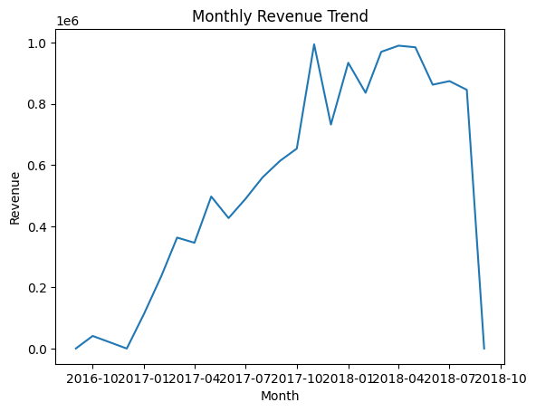
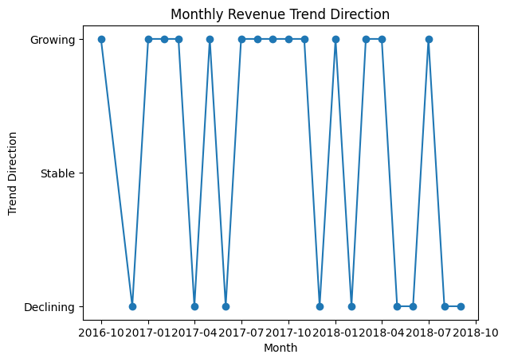
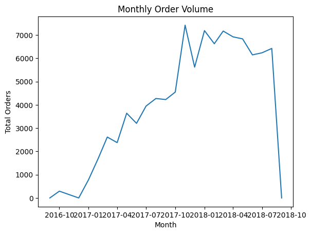

# Sales Revenue Analysis for an E-Commerce Platform

## 📊 Introduction
This project performs a sales and revenue analysis on a real-world e-commerce dataset using PostgreSQL.
The main goal is to analyze revenue performance, order dynamics, and product category performance through structured SQL queries.

This project simulates a real analytics workflow:
- 1. Database creation
- 2. Schema design with relational constraints
- 3. Data ingestion
- 4. Business-oriented analytical queries

## 📂 Dataset 
The project usess the [Brazilian E-Commerce Public Dataset by Olist](https://www.kaggle.com/datasets/olistbr/brazilian-ecommerce), which constrains real transactional data from a Brazilian online marketplace.

This dataset includes information about:
- Customers and sellers
- Orders and orders statuses 
- Producst and product categories
- Payments and reviews 
- Geolocation data

## 🛠️ Tech Stack
- **Database:** PostgreSQL
- **Query Language:** SQL
- **Data Source:** CSV files (Kaggle dataset)
- **Environment:** Visual Studio Code 

## 🔍 ANALYSIS QUESTIONS
#### 1️⃣Executive / Revenue Performance
“How is the business doing?” 
- 1. How much total revenue did the platform generate?
- 2. How does revenue trend monthly?
- 3. Is revenue growing or declining over time?
This section evaluates overall business health and growth trends.

#### 2️⃣ Order & Sales Dynamics
These answer: “How are orders behaving?”
- 1. How many total orders were placed?
- 2. How many orders per month?
- 3. What is the average items per order?
- 4. What percentage of orders are completed vs canceled?

#### 3️⃣ Product Categoryies Performance
These answer: “What products drive revenue?”
- 1. Which product categories generate the highest revenue?
- 2. Which product categories sell the highest quantity?

## 📈 The Analysis

### 💰 Revenue Performance

#### Total Revenue (Delivered & Shipped Orders)

To calculate total revenue from fulfilled transactions, only orders with a status of **`delivered`** or **`shipped`** are considered.  
Revenue is defined as the **sum of item-level product prices** from the order items table.

> **Note:** This metric represents **product revenue only** and does not include freight or shipping charges.

```sql
SELECT 
    SUM(oi.price) AS delivered_items_revenue
FROM order_items_dataset oi
INNER JOIN orders_dataset o 
    ON o.order_id = oi.order_id
WHERE o.order_status IN ('delivered', 'shipped');
```

Total Items Revenue (Delivered & Shipped Orders) **13 372 225.55**

---

#### Monthly Revenue Trends (Delivered & Shipped Orders)

Monthly revenue trends are calculated based on the **order purchase date**.  
Only orders with a status of **`delivered`** or **`shipped`** are included, and revenue is defined as the **sum of item-level product prices**.

```sql
SELECT
    SUM(oi.price) AS monthly_revenue,
    TO_CHAR(o.order_purchase_timestamp, 'YYYY-MM') AS year_month
FROM orders_dataset o
INNER JOIN order_items_dataset oi 
    ON o.order_id = oi.order_id
WHERE o.order_purchase_timestamp IS NOT NULL
  AND o.order_status IN ('delivered', 'shipped')
GROUP BY year_month
ORDER BY year_month;
```
The chart below illustrates the **monthly revenue trend** based on delivered and shipped orders.

Revenue shows a **strong upward trend from early 2017 through 2018**, indicating consistent business growth and increasing transaction volume over time.  
Short-term fluctuations are visible, which are typical for e-commerce platforms due to seasonality and demand changes.



---

#### Whether Revenue Is Growing or Declining (Month-over-Month)

To determine whether revenue is **growing or declining**, monthly revenue is first calculated based on the **order purchase date** for orders with a status of **`delivered`** or **`shipped`**.  
Revenue is defined as the **sum of item-level product prices**. Then, the previous month’s revenue is retrieved using a window function (`LAG`) to compute the month-over-month change and classify the trend direction.

```
WITH monthly_revenue AS (
    SELECT
        DATE_TRUNC('month', o.order_purchase_timestamp) as month,
        SUM(io.price) as revenue
    FROM orders_dataset o
    INNER JOIN order_items_dataset io ON o.order_id = io.order_id
    WHERE o.order_status IN ('delivered', 'shipped')
    GROUP BY month
    ORDER BY month
),
previous_month_revenue AS (
    SELECT
        month,
        revenue,
        LAG(revenue) OVER (ORDER BY month) AS prev_month_revenue
    FROM monthly_revenue
)
SELECT 
    TO_CHAR(month, 'YYYY-MM') as month,
    ROUND(revenue) as revenue,
    ROUND(prev_month_revenue) AS prev_month_revenue,
    ROUND(revenue - prev_month_revenue) AS revenue_change,
    CASE
        WHEN revenue > prev_month_revenue THEN 'growing'
        WHEN revenue < prev_month_revenue THEN 'declining'
        ELSE 'flat'
    END AS trend_direction
FROM previous_month_revenue
ORDER BY month;
```
#### Revenue Growth Direction (Month-over-Month)

The chart below shows the **direction of revenue change** on a monthly basis.  
Each month is classified as **Growing**, **Declining**, or **Stable** based on the change in revenue compared to the previous month.

This visualization highlights:
- Periods of sustained growth
- Short-term revenue declines
- Overall revenue momentum over time



### 🛒 Order & Sales Dynamics

The total number of orders with a status of **`delivered`**, **`shipped`**, **`approved`**, **`invoiced`**, or **`processing`** is **98,202**.  
These orders represent valid customer purchase activity on the platform.

---

#### Monthly Order Volume

The chart below shows the **number of orders placed per month** based on fulfilled transactions ('delivered', 'shipped', 'approved', 'invoiced', 'processing').
Order volume increases significantly from early 2017, reaching its highest levels in late 2017 and early 2018.  
This trend indicates growing customer adoption and higher platform activity over time.

> **Note:** The sharp decline in the final month is due to **incomplete data**, not an actual reduction in order activity.


---

#### Average Items per Order

The **average number of items per order** is **1.14**, indicating that most customers purchase **a single item per transaction**, with a smaller proportion placing multi-item orders.

---

#### Completed vs Canceled Orders

The chart below compares the number of **delivered** and **canceled** orders on the platform.

The results show that the overwhelming majority of orders are successfully delivered, while canceled orders represent only a small portion of total transactions.  
This indicates strong operational efficiency and reliable order fulfillment.


